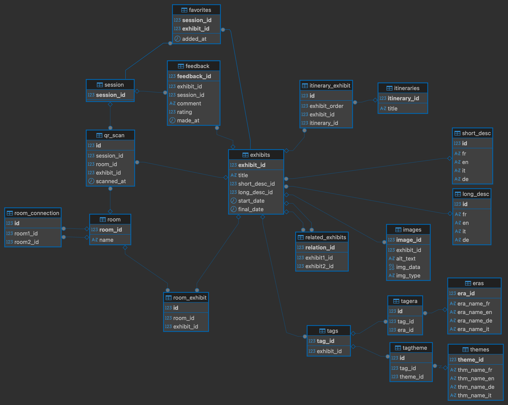

# GenLog-DB-MuseumApp

This project is done during our Software engineering and DataBase courses that we're following in the 2nd year of Computer Science Bachelor cursus from the University Of Applied Science of Sion, Valais, Switzerland.

This repository contains a multi-application Flutter ecosystem designed to improve museum visits through QR-based interactions, content management tools, and visitor analytics.

---

## Project Goals

The goal of this project is to provide:

- A visitor-friendly mobile application for exploring museum exhibits
- A content editor application for managing exhibitions
- An analytics dashboard for curators
- An admin interface for system management
- A centralized PostgreSQL database containerized with Docker


---

## System Overview

The project is composed of multiple independent Flutter applications, each targeting a specific role:

| Role | Application |
|-----|------------|
| Visitor | Visitor App |
| Editor | Editor App |
| Curator | Analytics App |
| Administrator | Admin App |

All applications rely on a shared database.

---

## Applications and Features

### Visitor App (`visitor/visitor_app`)

Designed for museum visitors.

Main features:
- QR code scanning to access exhibit information
- Display of exhibit descriptions, images, and metadata
- Rating system (1 to 5 stars)
- Favorite exhibits
- Thematic itineraries
- Anonymous visitor feedback

Target platform: Mobile (Android / iOS)

---

### Editor App (`editor/editor_app`)

Designed for museum staff responsible for content management.

Main features:
- Create new exhibits/rooms/itineraries
- Edit existing exhibits/rooms/itineraries
- Delete exhibits/rooms/itineraries
- Manage descriptions, metadata, and related content

Target platform: Mobile / Desktop

---

### Analytics App (`analytic/analytic_app`)

Designed for curators and museum managers.

Main features:
- Visualization of visitor statistics
- Analysis of exhibit popularity and engagement
- Support for data-driven decision making

Target platform: Mobile / Desktop

---

### Admin App (`admin/admin_app`)

Designed for system administrators.

Main features:
- Database supervision

Target platform: Mobile / Desktop

---

## Database

The system uses a PostgreSQL database shared by all applications.

- Containerized using Docker
- SQL schema included in the repository
- Visual schema available as an image

### Database Schema



---

## Docker Setup

Make sure Docker Desktop or Docker Engine is running.

Start the database:
```
docker compose up -d
```

Stop the database:
```
docker compose stop
```

Recreate the database (deletes all data):
```
docker compose down -v
docker compose up -d
```

---

## Development Requirements

Required tools:
- [Flutter](https://flutter.dev/docs/get-started/install) SDK
- Java JDK (JAVA_HOME configured)
- Android SDK and platform-tools
- Docker and Docker Compose
- PostgreSQL (via Docker)


## Setup Android emulator on Windows
### Environment Variables

Add to your PATH or verify:
On Windows:
```powershell
$env:ANDROID_SDK_ROOT="C:[YOUR PATH]\platformTools\AndroidSDK"
$env:PATH += ";C:[YOUR PATH]\platformTools\AndroidSDK\platform-tools"
```


### Android SDK Components

Accept licenses:

```powershell
sdkmanager --licenses
```

Install required packages:

```powershell
sdkmanager "platform-tools" "cmdline-tools;latest" "system-images;android-33;google_apis;x86_64"
```

### Create and Launch an AVD

Create an Android Virtual Device (AVD) using Android Studio or command line.
Example for Pixel 6 API 33:

```powershell
cd C:[YOUR PATH]\platformTools\AndroidSDK\emulator
.\emulator.exe -avd Pixel_6_API_33
```

Check the emulator is recognized:

```powershell
adb devices
```

> If `adb` is not recognized, make sure `platform-tools` is in your `PATH`.

---

## Setup Android emulator on Mac
### [Download android studio](https://developer.android.com/studio?hl=fr)
1) go to Settings | Languages & Frameworks,

2) download your platform of choice at Android SDK,

3) under SDK Tools, make sure **build-tools**, **platform-tools**, **command-line tools** and **emulator** are installed.

### Set environment variables
```unix
nano ~/.zshrc
```
```nano
export ANDROID_SDK_ROOT=/Users/[YOUR USER]/Library/Android/sdk
export ANDROID_HOME=$ANDROID_SDK_ROOT
export PATH=$PATH:$ANDROID_SDK_ROOT/platform-tools
export PATH=$PATH:$ANDROID_SDK_ROOT/cmdline-tools/latest/bin
export PATH=$PATH:$ANDROID_SDK_ROOT/emulator
```

### Run emulator
On Android studio:
- More actions -> virtual device manager -> run


flutter will detect the device automatically.
___
## Setup iOS emulator on mac
brew install cocoapods

### Create simulator
- download ios xx on Xcode,
- on simulator: file -> new simulator,
- create your simulator.

### Codesign
0) If you don't have a developer account:
go on https://developer.apple.com and create one

1) Open ./ios/Runner.xcworkspace/ from the flutter app directory

2) runner -> signing capabilities:
   - enable automatially manage signing ,
   - select Team as personal team

/!\ Make sure the project isn't in Icloud or code signing will fail ! /!\

### Run simulator
Open simulator -> your device,

Flutter will detect the device automatically.

---

## Running a Flutter Application

1. Start an emulator or connect a physical device
2. Navigate to the desired application directory

Example:
```
cd visitor/visitor_app
flutter pub get
flutter run
```

Hot reload: `r`  
Hot restart: `R`

---

## Repository Structure

```
/
├── .vscode/
├── admin/
│   └── admin_app/
├── analytic/
│   └── analytic_app/
├── editor/
│   └── editor_app/
├── visitor/
│   └── visitor_app/
├── docker/
├── museum_DB-schema.png
├── README.md
└── ...
```

---

## Contributors

- Skitaarii
- Neb5384
- Dyumes


